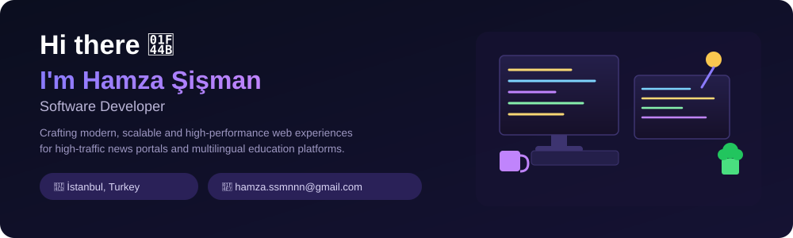
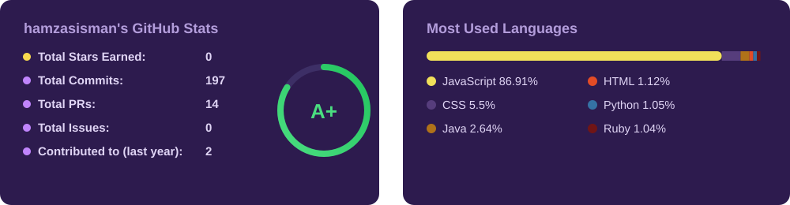

 

## 📊 GitHub Stats

 

# 🚀 Tech Stack
<table align="center">
<tr>
<td align="center">

### Frontend

</td>
<td align="center">

### Styling

</td>
</tr>
<tr>
<td align="center">

### Backend & APIs

</td>
<td align="center">

### Tools & Others

</td>
</tr>
</table>
 

## 🌐 Connect with Me

 

<i>"Code is like humor. When you have to explain it, it's bad."</i> — Cory House

